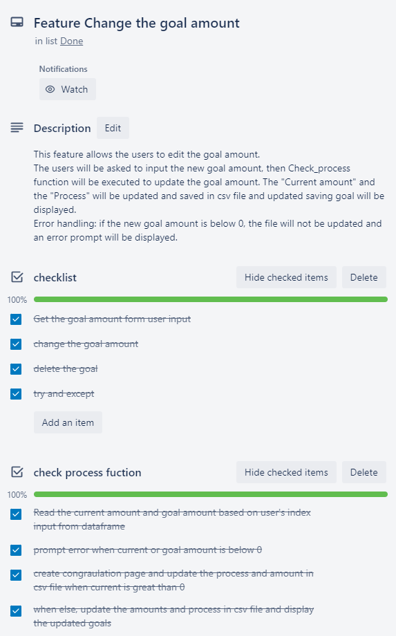
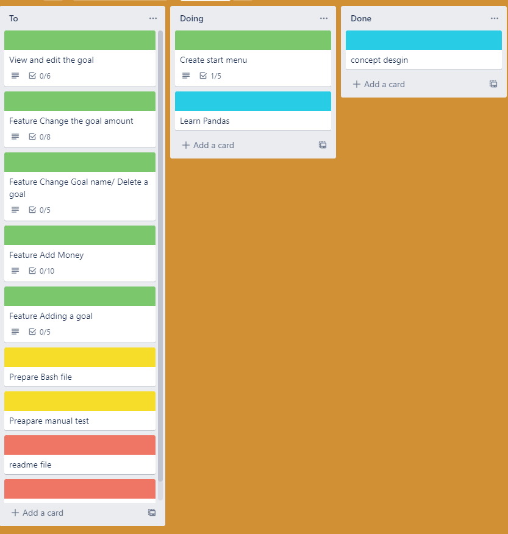
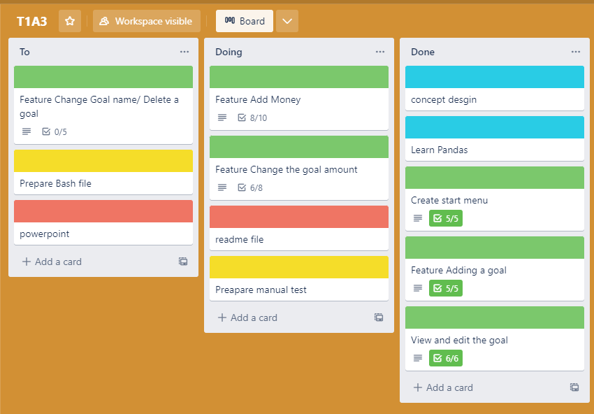

# Terminalapp
## Saving Goal
This app helps you set and track your saving goals.

Whether you're trying to save up for a new car, a trip to Tibet, or the latest iPhone. You can save all these goals to this app and update and view your saving goal progress at any time.

Repository Link: https://github.com/springbird123/terminalapp

Presentation Link: https://www.youtube.com/watch?v=AUtbsJTWbrA

# Code style
This application follows the PEP 8 (Van Rossum, Warsaw, & Coghlan 2022) code style.

[PEP 8 – Style Guide for Python Code](https://peps.python.org/pep-0008/)

# Features

### Feature 1 Main Navigation Menu
This feature allows users to select different options on this application.

It firstly uses a welcome function to clear the screen and load the logo and welcome message.

It displays all the main options that the user can select by entering the number before the option. The application will execute the function corresponding to the option using if/else conditions.

If user's input is not a number between 1-4 or any other invalid, an error message will be displayed. Then the user can try again.

### Feature 2 Create a saving goal
This feature allows the users to create a new saving goal and this new saving goal will be saved in a csv file for future use.

The users will be asked to input the name of the new saving goal and the goal amount they want to save.

When the goal amount input is not a number above 0, an error prompt will be displayed and user can try again.

### Feature 3 Add Money 
This feature allows the users to add money to saving goals (one saving goal at a time).

User will be asked to choose the goal they want to add money by inputting index of the goal. Then they can input the amount they want to add. 
Then check_process feature will be executed to add the amount to the current amount. the "current amount" and the "process" will be updated and saved in csv file and updated saving goal will be displayed. 

Error handling: when there is no saving goal in the csv file, this feature will not run; when the index input is not in saving goal table, a error prompt will be displayed; when the amount input is not a number above 0, an error prompt will be displayed and user can try again; when current amount is below 0, it will not be updated and an error prompt will be displayed.

### Feature 4 View saving goal(s)
This feature allows the users to view all the saving goals.

It is achieved by the function view_goal, and it is also used by multiple other features. People can input 3 from menu to directly use it.

It clears the screen. And then displays the logo and saving goal table from the csv file if there are any saving goals.
if there is no saving goal in the csv file, a message "There is no saving goal yet, return to the main menu to create a new one!" and ASCII text"EMPTY......" will be displayed and user can return to main menu.

### Feature 5 Edit saving goal(s)
This feature allows the users to choose other edit features such as, change the goal name, change the goal amount, and delete a saving goal.

It uses "view saving goals" feature (feature 4) to display all the saving goals, users can input index of the saving goal that they want to edit. Then it displays the editing menu that the user can select by inputing the number before the option. The application will execute the feature corresponding to the option using if/else conditions.

Error handling: When users index is not valid, this feature will not run; if user's input is not a number between 1-5 or any other invalid input, an error message will be displayed. Then the user can try again.

### Feature 6 Edit the goal name
This feature allows the users to edit the goal name.

The users will be asked to input the new saving name, then this new saving name will be saved in a csv file and displayed.

### Feature 7 Edit the goal amount
This feature allows the users to edit the goal amount.

The users will be asked to input the new goal amount, then Check_process 

function will  be executed to update the goal amount. The "Current amount" and the "Process" will be updated and saved in csv file and updated saving goal will be displayed.

Error handling: if the new goal amount is below 0, the file will not be updated and an error prompt will be displayed.

### Feature 8 Delete the goal
This feature allows the users to delete saving goals.

The deleted saving goal will be removed from the csv file, and the updated 

goal list or empty goal table message will be displayed.

#  Implementation plan
Trello Board link: https://trello.com/b/J0Msym7k/t1a3

Feature Card example:

 Development Stage:

# Help documentation
## System requirements
Operating system: Windows 7 to 11 Linux- Ubuntu 16.04 to 17.10 
with least 2 2GB RAM

## Installation
1. Visit githube  repository https://github.com/springbird123/terminalapp 
2. Click "<> Code"  button and click "Download ZIP" to download the .zip file
3. Unzip the file
4. Open the terminal or command prompt and navigate to the 'terminal-app' directory by using the 'cd' command.
5. Use the commands 'bash setup.sh' or './setup.sh' in your terminal or command prompt to run the application.

# Manual Tests
## Manual Test 1
To test weather a new goal is correctly added to saving_goal.csv.

### Case 1, a new goal with the name "A new goal" and a valid saving amount (eg: 100) is saved in saving_goal.csv: 
1.	Run main.py, screen is cleared. Then the logo with welcome message, and main menu will be displayed on the screen.
2.	From menu, input "1000" to run option "1. Creat a New Saving Goal". Then the screen will show "Please enter the goal name: "
3.	Input "A new goal" as the name of the goal and press enter. Then the screen will show "Please enter the amount you want to save: ".
4.	Input "1000". Then the screen will show "Your new saving goal has been created!" and "Please Press Enter to back to menu: ". The "saving_goal.csv" file will include a new goal named "A new goal" with current amount "0", goal amount "100", and process "0%".
5.	Press "Enter", main menu displays. 

### Case 2, input a new goal with the name "A new goal" and an invalid saving amount (eg: -100, x). This will not successfully create a new goal until a valid saving amount is input:
1.	Run main.py, screen is cleared. Then the logo with welcome message, and main menu will be displayed on the screen.
2.	From menu, input "1" to run option "1. Creat a New Saving Goal". Then the screen will show "Please enter the goal name: "
3.	Input "A new goal" as the name of the goal and press enter. Then the screen will show "Please enter the amount you want to save: ".
4.	Input "-100". The screen will show "Please enter a positive number." and it will show "Please enter the amount you want to save: " again. The "saving_goal.csv" file is not changed
5.  Input "x". The screen will show "Please enter a valid amount" and "Please enter the amount you want to save: " again. The "saving_goal.csv" file is not changed
6.  Input "100". The screen will show "Your new saving goal has been created!". and "Please Press Enter to back to menu: ". The "saving_goal.csv" file will now include a new goal named "A new goal" with a defalut index 0, current amount "0", current amount "100", and process "0%".
7.	Press Enter, main menu displays. 

## Manual Test 2
Check when edit the goal amount of the example goal "Tibet Travel (example)" which has index 0, current amount "500", goal amount "2000", and process "25%", wheather the new goal amount input is excauted correctly.

### case 1, input a vaild new goal amount(1000) which is greater than current amount(500):
1.	Run main.py, screen is cleared. Then the logo with welcome message, and main menu will be displayed on the screen.
2.	From menu, input "3" to enter "3. View and Edit all Saving Goals". Main menu is cleared and then the goal list which includes "Tibet Travel (example)" with a defalut index 0, current amount "500", goal amount "2000", and process "25%" is displayed. The screen also displays "Please enter the index of the saving goal that you want to edit: "
3. input 0. The editing menu is displayed, and screen also displays "Please enter the edit number(1-5): Edit "
4. input 2, screen displays "Please enter the new goal amount: "
5. input 1000. The screen displays the updated "Tibet Travel (Example)"'s goal amount as 1000, and process changes to 50.00%. The screen also prompts "You successfully updated the goal amount, please press enter to return to the main menu"
6. Press enter. The screen is cleared and displays main menu.

### case 2, input a vaild new goal amount(400) which is less than current amount (currently saved amount) (eg. 500):
1.	Run main.py, screen is cleared. Then the logo with welcome message, and main menu will be displayed on the screen.
2.	From menu, input "3" to enter "3. View and Edit all Saving Goals". Main menu is cleared and then the goal list which includes "Tibet Travel (example)" with a defalut index 0, current amount "500", goal amount "2000", and process "25%" is displayed. The screen also displays "Please enter the index of the saving goal that you want to edit: "
3. input 0. The editing menu is displayed, and screen also displays "Please enter the edit number(1-5): Edit "
4. input 2, screen displays "Please enter the new goal amount: "
5. input 400. The screen is cleared and displays congratulations message. In saving_goal.csv file "Tibet Travel (Example)"'s goal amount updates to 400, its process updates to "Completed!". 
6. Press enter, screen is cleared and displays main menu.

### case 3: input a invaild new goal amount(-1):
1.	Run main.py, screen is cleared. Then the logo with welcome message, and main menu will be displayed on the screen.
2.	From menu, input "3" to enter "3. View and Edit all Saving Goals". Main menu is cleared and then the goal list which includes "Tibet Travel (example)" with a defalut index 0, current amount "500", goal amount "2000", and process "25%" is displayed. The screen also displays "Please enter the index of the saving goal that you want to edit: "
3. Input 0. The editing menu is displayed, and screen also displays "Please enter the edit number(1-5): Edit "
4. Input 2. The screen displays "Please enter the new goal amount: "
5. Input -1. The screen displays"current/goal amount can not be below 0, please try again", and it displays"Please press enter to return the main menu:".
6. Press enter, screen is cleared and displays main menu.